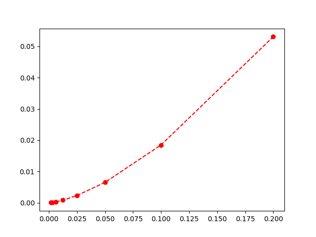
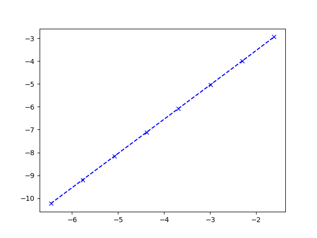

# Lab 4

### Problem 1
see the code in Problem1.py nad Problem1_test.py
the time comparison is in time.txt

#### 2) 
$-sin''(\pi x) = f(x) \implies f(x) = \pi ^2 sin(\pi x)$

where $\alpha = 0,\beta = 0$

#### 4)
please see the below graphs
I have n doubles every iteration, which will shirnk h to 1/2 every iteration. which this looks like quadratic

and the following log(error) against log(h), which is linear and hence we can conclude that p = 2, because n doubles every time

